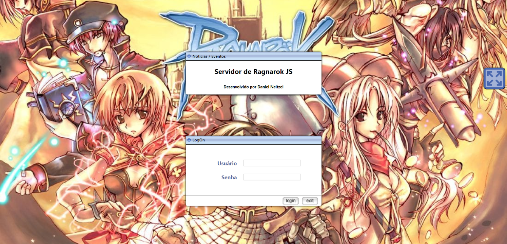
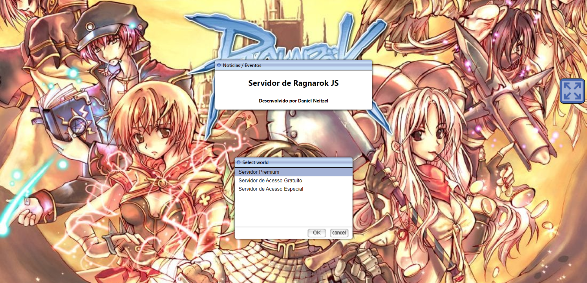
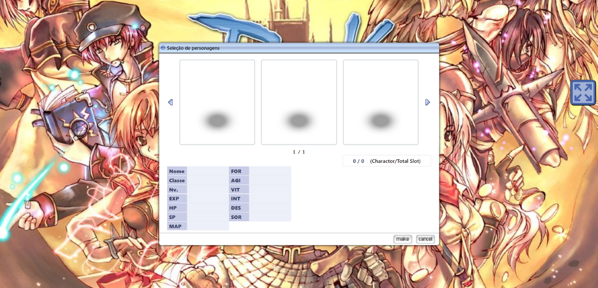
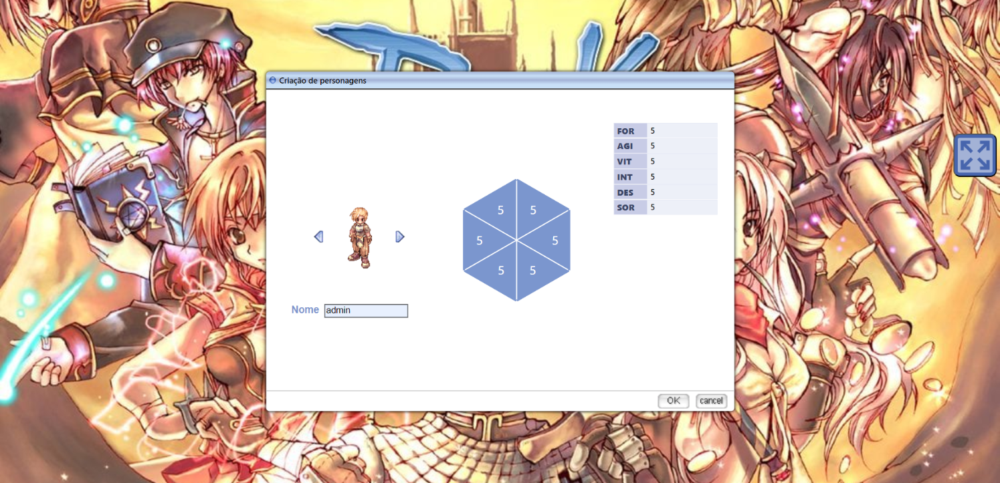
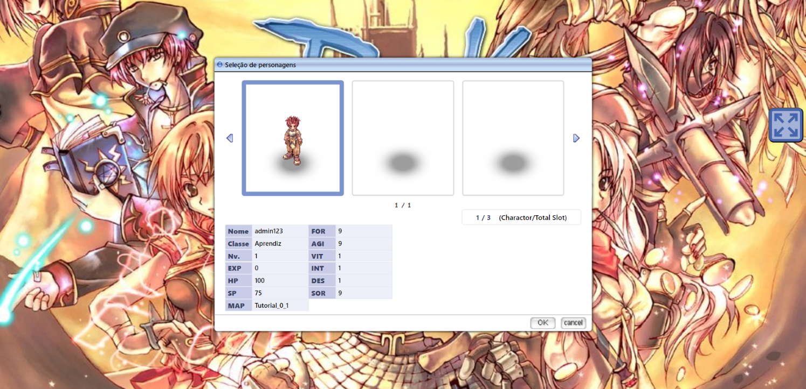
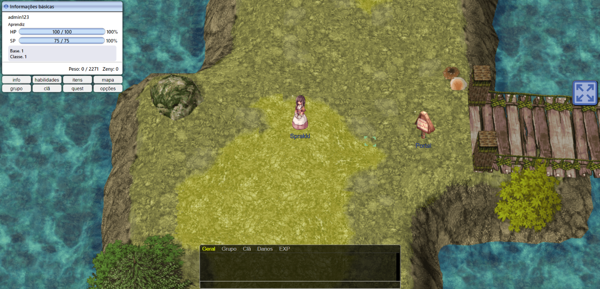

# ragnarok-online-JS
Uma replica do login, seleção de usuario e carregamento do jogo Ragnarok Online construido somente com HTML, CSS e JS puro.
 
Visualizar: 
<a href="https://danvneitzel.github.io/ragnarok-online-JS/" target="_blank">
  https://danielvneitzel.github.io/ragnarok-online-JS/
</a>
 

<h1>Status dos sistema a serem desenvolvidos:</h1>
🟢 Concluído
🟡 Em Desenvolvimento
🔴 Não Iniciado

  

<ul>
  <li>Sistema de login (arquivo JSON) 🟢</li>
  <li>Sistema de seleção e validação de servidor (arquivo JSON) 🟢</li>
  <li>Sistema recuperação e gravação da criação do personagem 🟡</li>
  <li>Sistema de distribuição de pontos (FOR, AGI, VIT, INT, DEX, SOR) 🟢</li>
  <li>Sistema de gerenciamento de skin do personagem na criação 🟢</li>
  <li>Desenvlvimento de regras de validação do nome do personagem 🟡</li>
  <li>Sistema de dialogo entre player e Npc 🟡</li>
  <li>Atualização de HP, SP, Level e Experiencia do personagem 🟡</li>
  <li>Definições de Sistema de batalha usando ABS ou Batalha por Turnos 🔴</li>
  <li>Animações de passagem de nivel e interação com NPC's 🔴</li>
  <li>Controle de Mapas e transição entre eles quando player for teleportado 🟡</li>
</ul>

  
<h2>LOGIN</h2>

> Tela de login desenvolvida utilizando as bases do jogo, criado somente baseando em código, menos imagens possivel.

 
<h2>SELEÇÃO DO SERVIDOR</h2>

> Criado regra de verificação do arquivo de configuração do player para permitir ou não a entrada do mesmo.

 
<h2>SELEÇÃO DE PERSONAGENS</h2>

> Criado elementos da tela com interação com as setas de seleção do SLOT do player.

 
<h2>CRIAÇÃO DE NOVO PERSONAGEM</h2>

> Criado Sistema de distribuição de pontos juntamente com validações de nome de usuario e seleção de skin do jogador.

 
<h2>APÓS CRIAÇÃO DE PERSONAGEM</h2>

> Após a criação do personagem é apresentado informações basicas inseridas no arquivo JSON de configuração dos jogadores.

 
<h2>SISTEMA DE LOADING PARA CARREGAR INFORMAÇÕES E MAPAS NO LAYOUT</h2>

> Adicionado contabilizador para replicar loading que existe no jogo quando necessario carregamento de elementos de mapa e npc's.

 
<h2>DESENVOLVIDO MAPAS COM SEUS RESPECTIVOS NPCS E WARPS</h2>

> Desenvolvido o sistema de janelas igualmente no jogo juntamente com pequenos sistemas incluindo chat global funcional.

 
